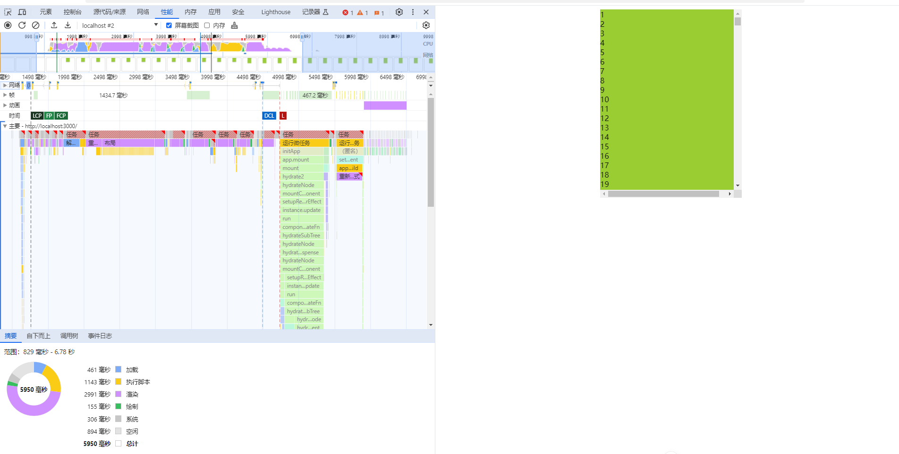
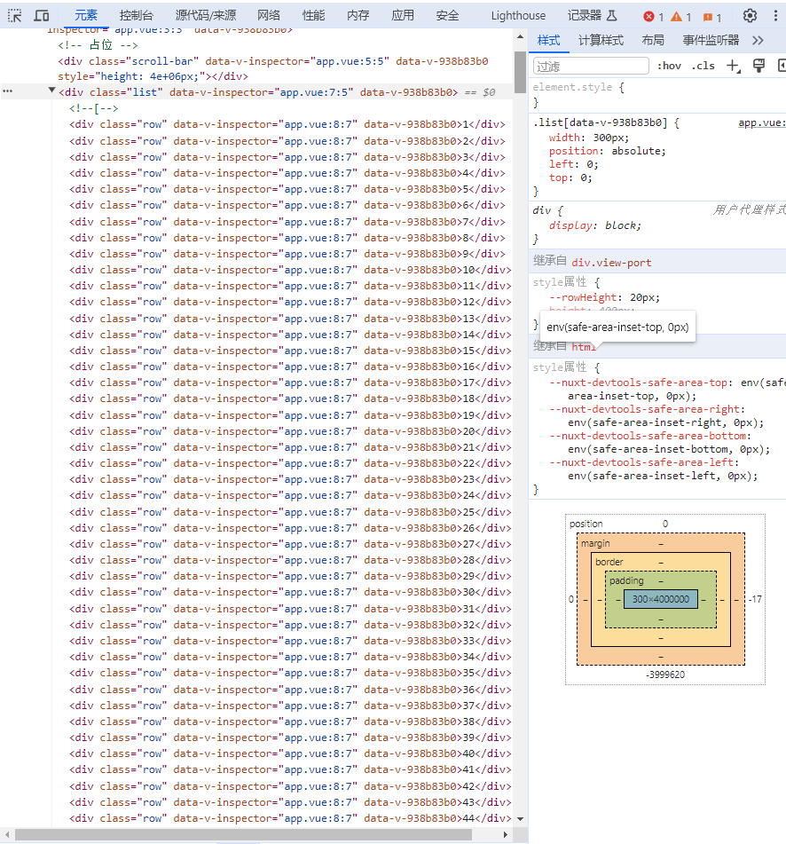
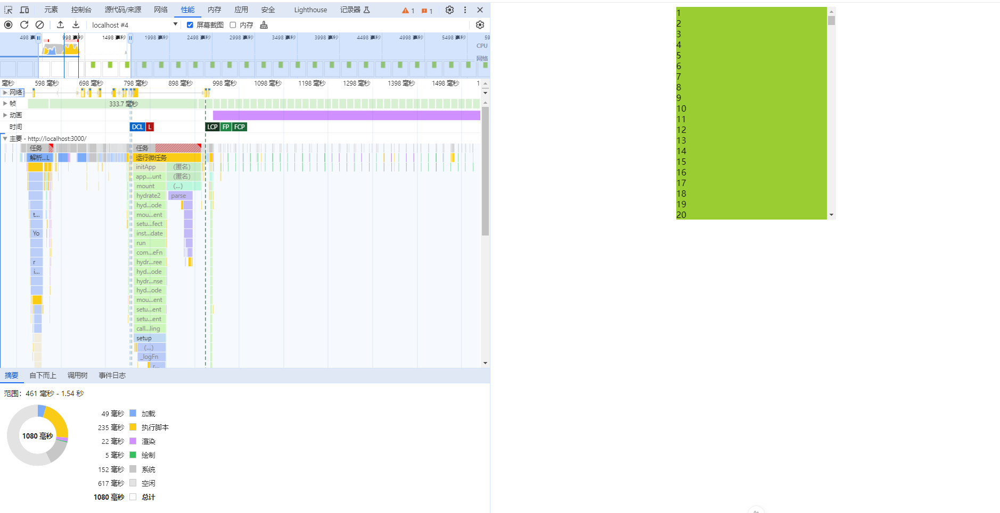
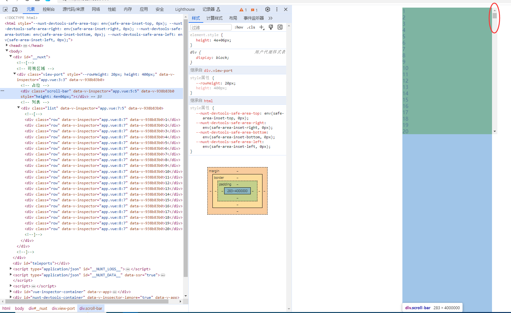
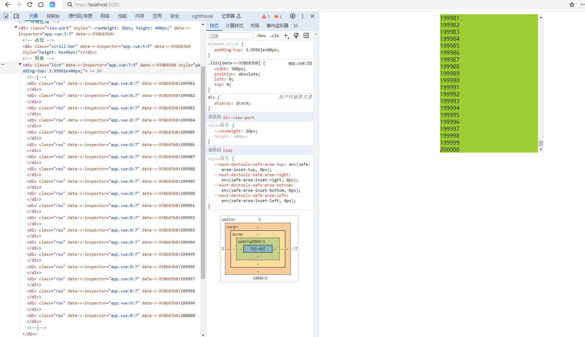

## 背景
- 当页面要展示大量数据时，即使很简单的功能，用户依旧会感受到卡顿。例如展示20万数据（单纯数字），性能分析如下图所示。


> 可以看出执行脚本和渲染时间很长。数据Dom是跟随数据量增长。一般响应时间超过3秒用户明显能感受卡顿。
- 要解决卡顿，我们要做的思路就是数据Dom只生成用户可视的那一页数据。

## 代码实现

### html代码
```
  <!-- 可视区域 -->
  <div class="view-port" ref="viewPort" :style="{ '--rowHeight': rowHeight + 'px' }" @scroll="onScroll">
      <!-- 占位 -->
    <div class="scroll-bar" ref="scrollBar"> </div>
    <!-- 列表 -->
    <div class="list" ref="listRef">
      <div class="row" v-for="(item, index) in showList">
        {{ item.n }}
      </div>
    </div>

  </div>
```

### CSS代码

```
.view-port {
  width: 300px;
  /* height: 300px; */

  background-color: yellowgreen;
  position: relative;
  left: 0;
  top: 0;
  right: 0;
  bottom: 0;
  margin: auto;
  overflow-y: scroll;
  overflow-x: hidden;
}

.list {
  width: 300px;
  position: absolute;
  left: 0;
  top: 0;
}

.row {
  /*height: 20px;*/
  height: var(--rowHeight);
}
```


###  造数据
```
// 造20万数据，fill是填充的功能
const bigList = new Array(200000).fill(null).map((ele, i) => ({ n: i + 1 }))
```

### 要渲染的列表数据
```
//从bigList取数据 开始偏移量
let start = ref(0)
//从bigList取数据 结束偏移量
let end = ref(20)
//  显示的数据列表
const showList = computed(() => {
  return list.value.slice(start.value, end.value)
})
```

### 初始化滚动区域高度与占位布局的高

```
onMounted(() => {
  console.log("挂载完成")
  //   滚动区域的高
  viewPort.value.style.height = (rowHeight.value * viewCount.value) + 'px'
  //  占位的高
  scrollBar.value.style.height = (rowHeight.value * list.value.length) + 'px'

})
```
###  滚动时切换要渲染的是数据并移动显示list布局位置
```
const onScroll = () => {
  //  滚动偏移量
  let offsetTop = viewPort.value.scrollTop
  console.log("offsetTop " , offsetTop)
  // 滚动后，计算开始和结束位置
  start.value = Math.round(offsetTop / rowHeight.value)
  end.value = start.value + viewCount.value
  console.log(" start.value ",start.value ," end.value ",end.value )
  // list 要下移的位置 transform  或 paddingTop 都能实现效果
  // listRef.value.style.transform = `translateY(${offsetTop}px)`
    listRef.value.style.paddingTop = `${offsetTop}px`
}
```


##  运行效果
- 执行脚本和渲染时间大大减少，如下图所示。


- `scroll-bar`是占位的作用，以便显示滚动条。`list`里的数据只生成一页数据。

- 根据滚动的偏移量，`list`中的数据将会动态改变，由于它是`absolute`布局，同时要修改位置（利用padding-top或transform值动态改变）。


## 总结
- 可视窗口只显示一页数据，设置占位，把滚动条显示出来。然后根据偏移量动态改变显示的数据，同时要修改`list`位置。使其在可视窗口内。

- 源码地址: [https://github.com/1030907690/virtual-rolling](https://github.com/1030907690/virtual-rolling)


## 参考
- [https://www.bilibili.com/video/BV1T24y1V7iE](https://www.bilibili.com/video/BV1T24y1V7iE)
